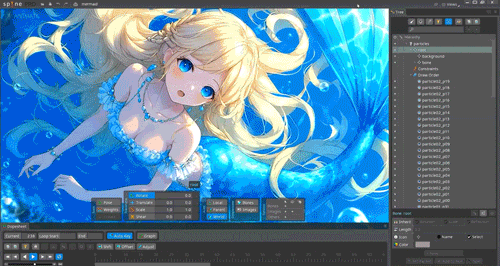

# Particle Editor

[繁體中文](README.md) | **English**

Create, preview, bake, and export particle-based skeletal animations for **Spine 3.8.99** directly in your browser.

No installation or account is required. Images, settings, and exported files are processed locally in the user's browser.

This repository is the **introduction, documentation, and issue-reporting page** for Particle Editor. It does not contain the editor source code.




## Try It Online

### [Open Particle Editor](https://particle-editor.kirinlab.workers.dev/)

### Online URL: [https://particle-editor.kirinlab.workers.dev](https://particle-editor.kirinlab.workers.dev/)

### [Watch the YouTube Tutorial](https://youtu.be/a_gSDpEJlk4)

### [Detailed Input/Output Tutorial with Channel Subtitles](https://youtu.be/3RqR93i5vqA)

If you have ideas for future updates, feel free to leave a request in the comments on the YouTube tutorials. The author will review the feedback and consider it as a reference for future development.

The current version:

- Does not collect analytics
- Does not upload project images or settings
- Does not upload exported JSON or ZIP files
- Does not require a name, email address, or GitHub account

**[Support continued development (Ko-fi)](https://ko-fi.com/kirinylab)**

## What Does It Do?

Particle Editor lets you create particle effects and export animations for Spine. Adjust movement, size, rotation, color, and opacity, then preview the result before exporting.

Key features:

- Chinese/English interface switching, with the preference stored only in the local browser
- Live particle preview
- Baked preview with fixed random results
- Loop animation preview
- Point, directional, circle, ring, box, and box-ring emitters
- Independent X/Y coordinates for each emitter, consistent across preview and Spine export
- Duplicate the selected emitter's settings, curves, and image for color or variation effects
- Directional emitters support total spread angle, emitter width, and even initial positions
- Circle, ring, box, and box-ring dimensions up to 10,000 px
- Outward, inward, and split emission directions
- Evenly distributed initial spawn positions
- Random seeds: with other settings unchanged, the same seed reproduces the effect; change the seed to try a different distribution
- Emission duration, particle lifetime, and random variation
- Up to 300 particles per emitter; higher counts increase export size and preview load
- A separate Motion section with Distance and Initial Speed (physics) modes
- Emission, speed, size, and opacity curves
- Fixed random size per particle using Base Size +/- Random Size
- Editable color timeline with draggable keys
- Original-color and Multiply gradient modes
- Vertical gravity, 360-degree wind direction, wind strength, rotation speed, and direction alignment
- Optional background preview, positioning, and export
- 50%, 60%, and 70% loop cuts
- Set a target frame count for the loop animation
- One-click ZIP export

## How to Use

### Online Version

Open the online editor in a supported browser. No installation or sign-in is required.

### Offline Version

This repository contains only the introduction, documentation, screenshots, and issue-reporting page. It does not include an offline copy of the editor.

The offline test version is currently provided individually by the author. A download link will be published here if an official offline version becomes available.

## Recommended Workflow

1. Add, duplicate, or select an emitter. Set independent X/Y coordinates under ID / Naming when needed.
2. Adjust its shape, emission, motion, physics, rotation, and visual settings.
3. Use Live Preview to check the overall effect.
4. Select Bake to create a fixed version for preview and export.
5. Use Baked Preview to review the fixed export result.
6. For a looping animation, choose a 50%, 60%, or 70% loop cut and create the loop.
7. Use Loop Preview to check the `_repeat` animation.
8. For an exact duration, enter a frame count under Target Loop, then create and preview the target animation.
9. Enter a file name and export the bake.

After changing any parameters, create or update the bake again. Existing baked data is not updated automatically.

## Interface and Motion Modes

The emitter list and parameter controls are on the left, with the preview on the right. The first toolbar row contains preview, background, view, loading, and export controls; the second row contains the bake and loop workflow. Background and view settings open as floating panels without reducing preview height.

Each emitter has independent X/Y coordinates under **ID / Naming** and two choices under **Motion**:

- **Distance (legacy mode)**: sets the total distance traveled during the particle lifetime. Increasing lifetime lowers average speed. Older settings continue to use this mode.
- **Initial Speed (physics)**: sets launch speed directly in `px/s`. Increasing lifetime does not lower the selected initial speed. Use gravity and wind to adjust the effect.

After loading older settings, check emitter positions and movement before baking again.

## Loop Cuts

Creating a loop keeps the original animation and adds:

```text
original_animation_name_repeat
```

For example, an animation named `particle01` produces a loop named `particle01_repeat`.

Available cut ratios:

- **50%**: a shorter loop that may require closer overlap and trajectory inspection
- **60%**: shorter and denser loop timing
- **70%**: the default; a recommended starting point for previewing

Compare cut ratios in Loop Preview to check transitions and overall timing.

After changing the cut ratio, create the loop again so the preview and export use the same ratio.

### Target Loop Duration

After creating `_repeat`, enter the desired frame count under Target Loop, then create and preview the target animation. Changing the total duration may change the playback rhythm, so review the result before exporting.

If a warning appears or creation is blocked, follow the on-screen guidance to adjust the target frame count or particle settings, then create the loop again. Check the loop seam in Spine after export.

## Export Contents

Export Bake downloads a ZIP file. Its name includes identifying information to help distinguish multiple exports. The following example shows the contents for a project named `particles`:

```text
particles.zip
|- particles.json
|- particles_notforspine.json
`- images/
   |- 1_par_01.png
   |- 2_par_01.png
   `- background.png
```

- `particles.json`: animation data for importing into Spine
- `particles_notforspine.json`: Particle Editor settings for reloading the project; do not import this file into Spine
- `images/`: one particle image per emitter, plus the optional exported background

After reloading settings, check the loop-cut ratio and target frame count before creating the loop again.

## Importing into Spine

1. Extract the exported ZIP file.
2. In Spine, select **File -> Import Data**.
3. Select `particles.json`.
4. Point the image path to the extracted `images/` directory.
5. The original animation uses the emitter name. If a loop was created, an additional `_repeat` animation appears under Animations.

Particle Editor does not generate an `.atlas` file. Create one separately in Spine or another atlas tool if your workflow requires it.

## Custom Images and Backgrounds

Visual's Original Image Facing option can be Right, Up, Left, or Down. Angle Fine-tune compensates for artwork that is slightly tilted. To make the image follow its movement, enable Rotation's Align to Direction option and check the orientation in the preview.

- Each emitter uses a unique image name, such as `1_par_01.png` and `2_par_01.png`.
- Replacing an image after baking updates baked preview, loop preview, and export without changing the existing particle movement.
- Custom particle images preserve their original aspect ratio and pixel dimensions. Images larger than 2048 px on their longest side are resized proportionally.
- Base Size controls the displayed particle size using the image's longest side as the reference, while preserving its aspect ratio.
- Random Size adds variation to particle sizes. For example, Base Size 5 and Random Size +/-2 give a starting size range of 3 to 7 px. Use the size curve to adjust how size changes over time.
- Custom images under **2 MB** and no larger than **2048 px** are recommended.
- A background is used only for preview unless Export Background is enabled.
- Background images keep their original aspect ratio. Exported backgrounds retain the selected position and appear behind the particles.
- Fit Background adjusts only the preview view and does not affect the export.
- Reloading `_notforspine.json` restores background coordinates, but the image must be selected again.

## Preview Modes

- **Live Preview**: quickly reflects current settings; random details may change
- **Baked Preview**: plays the most recently fixed bake
- **Loop Preview**: reviews the `_repeat` loop you created

Replay restarts the current result without resampling it. Use Resample Bake to generate a different fixed result.

## Privacy Notes

- Images, settings, and exported files are processed in your browser; project content is not uploaded.
- Settings files are read only when you choose to load them.
- The editor does not collect usage analytics or track users.
- The Chinese/English interface preference is saved only in your local browser.

Checks of the version tested on **September 16, 2026** found no external transmission of project content during the tested loading, editing, preview, and export workflows. This result applies only to that version and those tested workflows.

The online version requires a connection to load the website. Website infrastructure may generate ordinary connection logs; Particle Editor itself does not actively collect or transmit project content.

## Usage and Licensing

Particle Editor is currently available as a **free public beta**. Its source code is not public.

This repository provides only the introduction, documentation, and issue-reporting page. It does not mean Particle Editor is open source and does not grant permission to copy, modify, redistribute, or sell the editor source code.

Without the author's permission, do not:

- Copy or redistribute the complete Particle Editor application
- Present a modified version as an official Particle Editor release
- Remove or alter author, version, or source attribution
- Sell copied versions or provide unauthorized commercial services based on them

Users may freely create and export their own particle animations through the official online editor. Images, settings, and output created by a user remain the property of that user.

## Compatibility and Limitations

- Target format: Spine 3.8.99
- Recommended browsers: latest Chrome or Edge
- Up to 10 emitters
- Up to 300 particles per emitter
- Higher particle counts increase the performance load of the preview and exported animation; choose counts that suit your project
- The browser preview and Spine may look slightly different; check the final result after import
- Baked and loop data exist only in the current browser session; loading settings requires baking again
- There is no automatic save; export the ZIP before closing the page
- Interface language affects labels only; it does not change exported file or animation names

## Reporting Issues

Use GitHub **Issues** to report test results, bugs, or feature requests. Users do not need collaborator access or write permission to this repository.

When reporting an issue, include:

- Browser and version
- Spine version
- Steps to reproduce
- A screenshot of the problem
- A shareable `_notforspine.json` example, when appropriate

Remove all company names, project names, confidential images, and other non-public information before submitting an issue.

## Supporting Continued Development

Particle Editor continues to improve through testing and feedback. If you find it useful, you may support continued maintenance through [Ko-fi](https://ko-fi.com/kirinylab). Support is entirely optional and does not affect features, exports, or usage rights.
