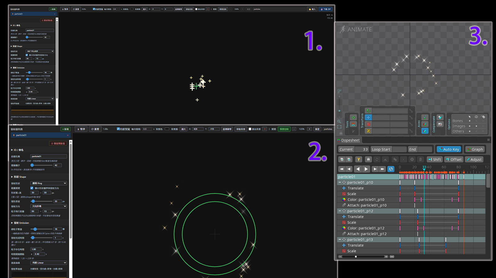

# Particle Editor

用瀏覽器快速建立、預覽並輸出適用於 **Spine 3.8.99** 的烘焙式粒子動畫。

不需要安裝套件，也不需要登入。圖片、參數與輸出內容都在使用者的瀏覽器中處理。

此 GitHub Repository 是 Particle Editor 的**工具介紹與問題回報頁面**，不包含編輯器程式碼。



## 立即使用

### [▶ 開啟 Particle Editor 線上版](https://particle-editor.kirinlab.workers.dev)

### 線上網址：[https://particle-editor.kirinlab.workers.dev](https://particle-editor.kirinlab.workers.dev/)

目前版本：

- 不收集使用分析資料
- 不上傳工作圖片或設定檔
- 不上傳輸出的 JSON 或 ZIP
- 不需要姓名、Email 或 GitHub 帳號

<br>

☕ 可選支持：[協助 Particle Editor 後續維護（Ko-fi）](https://ko-fi.com/kirinylab)

## 這個工具能做什麼？

Particle Editor 將粒子效果轉換成 Spine 可匯入的骨骼動畫。每顆粒子會成為一根骨骼，並將位置、大小、旋轉、顏色、透明度及圖片顯示狀態烘焙成時間軸。

主要功能：

- 即時 Canvas 粒子預覽
- 固定隨機結果的烘焙預覽
- 與輸出資料共用時間軸的循環預覽
- 點、方向、圓形、圓環、方形與方環發射器
- 方向發射器可設定發射總角度、發射口寬度與平均初始點
- 向外、向內及環形中心線內外分流
- 平均散佈初始發射點
- 發射完成時間、粒子生命時間與隨機變動
- 發射密度、速度、大小及透明度曲線
- 可新增、拖曳與刪除節點的顏色時間軸
- 原圖顏色與 Multiply 漸層模式
- 垂直重力、360° 風向與風力強度、旋轉速度及方向對齊
- 背景圖片預覽、座標設定及選擇性匯出
- 60%／70% 循環 cut
- ZIP 一鍵輸出

## 使用方式

### 線上版

直接開啟線上網址即可使用，不需要安裝或登入。

### 離線版

此 Repository 僅提供工具介紹、說明圖片與問題回報，不包含離線版工具檔案。

離線測試版目前由作者個別提供。請勿下載本 Repository 後尋找 `index.html` 或 `particle-editor.html`；如果未來提供正式離線下載，連結會公布在本頁面。

## 建議工作流程

1. 新增或選擇發射器。
2. 調整形狀、發射、物理、旋轉及視覺參數。
3. 使用「即時預覽」確認大致效果。
4. 點「產生烘焙」，固定每顆粒子的發射時間、生命、方向與隨機結果。
5. 使用「烘焙預覽」確認即將輸出的固定版本。
6. 如需循環動畫，選擇 60% 或 70% 循環 cut，再點「製作循環」。
7. 使用「循環預覽」確認 `_repeat` 動畫。
8. 輸入檔名並點「輸出烘焙」。

修改參數後，舊烘焙結果不會自動改變。請點「更新烘焙」產生新的固定版本。

## 循環 cut

製作循環後，工具會保留原動畫，並新增：

```text
原動畫名稱_repeat
```

例如原動畫名稱為 `particle01`，循環動畫會命名為 `particle01_repeat`。

循環 cut 可選：

- **60%**：循環較短、節奏較密集
- **70%**：預設值，並與目前的循環參考範例相容

cut 影格計算方式：

```text
總影格 = floor(原動畫總秒數 × 30)
cut影格 = floor(總影格 × 0.6 或 0.7)
```

工具會將 cut 後的動態移回 0f、刪除原位置中 cut 後的影格，並保留 cut 作為 `_repeat` 的最後影格。圖片 attachment 的顯示狀態也會一起處理。

切換 60%／70% 後，請重新點「製作循環」，避免預覽與輸出使用不同的比例。

## 輸出內容

所有支援的瀏覽器都會下載標準 ZIP。以檔名 `particles` 為例：

```text
particles.zip
├─ particles.json
├─ particles_notforspine.json
└─ images/
   ├─ 1_par_01.png
   ├─ 2_par_01.png
   └─ background.png
```

- `particles.json`：匯入 Spine 的正式動畫資料
- `particles_notforspine.json`：重新載入 Particle Editor 的設定檔，請勿匯入 Spine
- `images/`：每個發射器各自的粒子圖片，以及選擇匯出時的背景圖片

循環 cut 比例也會保存在 `_notforspine.json` 中。舊設定檔沒有此欄位時，會使用預設的 70%。

## 匯入 Spine

1. 解壓縮輸出的 ZIP。
2. 在 Spine 選擇 **File → Import Data**。
3. 選擇 `particles.json`。
4. 將圖片路徑指向解壓縮後的 `images/`。
5. 原動畫會使用發射器名稱；如果製作過循環，Animations 中也會出現 `_repeat` 動畫。

本工具不會產生 `.atlas`，如工作流程需要 Atlas，請在 Spine 或其他 Atlas 工具中另外建立。

## 自訂圖片與背景

- 每個發射器使用獨立檔名，例如 `1_par_01.png`、`2_par_01.png`，不會互相覆蓋。
- 自訂粒子圖片會保留原始寬高比例與像素尺寸；最長邊超過 2048 px 時才會等比例縮小。
- 「基礎大小」控制粒子在 Canvas 與 Spine 中的顯示尺寸，並以圖片最長邊為基準，不會再把非正方形圖片拉成正方形。
- 內建粒子圖會依基礎大小與大小曲線的最大倍率輸出足夠解析度，降低粒子放大時的鋸齒。
- 建議自訂圖片小於 **2 MB**。
- 建議最長邊不超過 **2048 px**。
- 較小的粒子圖片通常能獲得更穩定的預覽與較小的輸出檔案。
- 背景圖片只用於預覽；勾選「匯出背景」後才會寫入 ZIP。
- 背景會保持原始寬高比例，不會強制轉成正方形。
- 背景位置會寫入獨立的 `background` bone，並放在粒子 slot 下方。
- 重新載入 `_notforspine.json` 時會還原背景座標，但基於隱私與瀏覽器限制，使用者仍需重新選擇背景圖片。

## 預覽模式

- **即時預覽**：快速調整最新參數，隨機細節可能變化
- **烘焙預覽**：播放上一次固定的烘焙結果
- **循環預覽**：直接取樣即將輸出的 `_repeat` 時間軸

「重播」只會從頭播放目前結果，不會重新抽樣。若要產生不同的固定結果，請使用「重新抽樣烘焙」。

## 隱私與網路檢查

目前版本已完成靜態程式碼檢查，以及使用假 PNG、假粒子設定進行的自動化瀏覽器測試。測試涵蓋檔案載入、參數調整、預覽、烘焙、循環與 ZIP 匯出。

截至 **2026-07-22** 的檢查結果：

- 沒有發現跨網域請求。
- 沒有發現 POST、PUT、PATCH、DELETE、Fetch／XHR、WebSocket、EventSource 或 Beacon。
- 沒有第三方分析、追蹤或遙測服務。
- 只觀察到網站 HTML 與粒子預設圖片的同源 HTTPS GET。
- 使用者載入的圖片、粒子設定與完整輸出內容沒有傳送到外部網路。

這項結果只適用於檢查當時的版本與已測試流程；未來版本更新後會重新進行檢查。

## 隱私說明

目前版本是純前端工具：

- 工作圖片只在瀏覽器記憶體中處理
- 設定檔只在使用者主動載入時讀取
- JSON 與 ZIP 只在瀏覽器本機產生
- 沒有分析 API、使用者追蹤或裝置指紋

線上版仍會由網站服務提供 HTML 檔案，因此網站基礎設施可能產生一般性的連線紀錄；Particle Editor 本身不會主動收集或傳送工作內容。

## 使用與授權說明

Particle Editor 目前以**免費公開測試版**提供線上使用，原始碼未公開。

本 Repository 僅提供工具介紹、操作說明與問題回報，不表示 Particle Editor 採用開源授權，也未授予複製、修改、重新發布或販售本工具程式碼的權利。

未經作者同意，請勿：

- 複製或重新發布 Particle Editor 的完整程式。
- 將修改版本冒充為 Particle Editor 官方版本。
- 移除或變更工具中的作者、版本或來源標示。
- 以本工具的複製版本進行販售或提供未經授權的商業服務。

一般使用者可以透過官方線上網址免費建立及匯出自己的粒子動畫；使用者自行製作的圖片、設定與輸出內容仍屬於使用者本人。

## 相容性與限制

- 目標格式：Spine 3.8.99
- 建議瀏覽器：最新版 Chrome 或 Edge
- 最多 10 個發射器
- 每個發射器最多 80 顆粒子
- 每顆粒子會增加一根 Spine 骨骼，請依專案效能需求控制數量
- Canvas 與 Spine 是不同的繪圖環境，混合模式、曲線取樣與像素結果可能有細微差異
- 烘焙及循環結果只存在目前的網頁工作階段；重新載入設定檔後需再次烘焙
- 工具沒有自動存檔，關閉頁面前請先輸出 ZIP

## 問題回報

歡迎使用 GitHub **Issues** 提供測試結果、錯誤回報或功能建議。一般使用者不需要成為 Collaborator，也不需要取得這個 Repository 的寫入權限。

回報問題時，建議提供：

- 使用的瀏覽器與版本
- Spine 版本
- 操作步驟
- 問題畫面的截圖
- 可公開的 `_notforspine.json` 範例

請先移除任何公司名稱、專案名稱或不可公開的圖片與資料。

## 支持後續維護

Particle Editor 會持續依照測試回饋改善。若你覺得工具實用，也可以透過 [Ko-fi](https://ko-fi.com/kirinylab) 支持後續維護；完全自願，不影響工具功能、輸出內容或使用權限。
